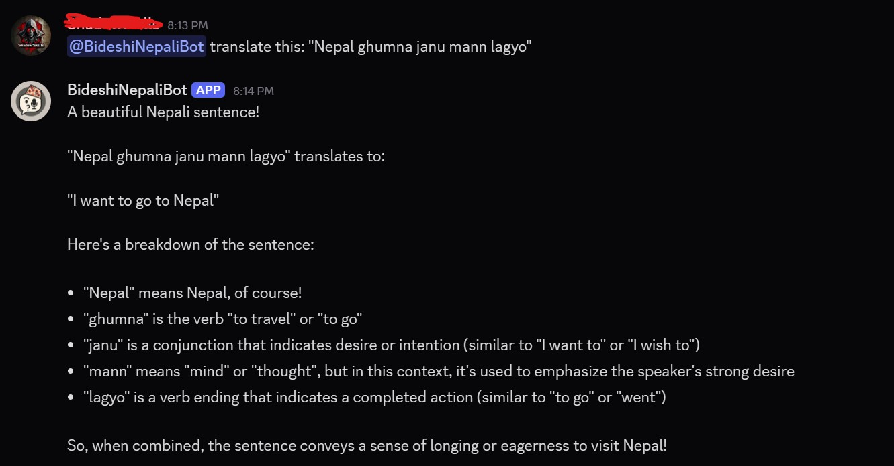

# BideshiNepaliBot: Technical Overview & Development Journey

This repository documents the development of a Discord-based AI operations assistant. The project transitioned from an experimental bilingual script to a hybrid cloud-local AI agent designed for specialized tasks: market auditing, geographical resolution, and automated information retrieval.

## Developer Profile
**Developer:** Avimanyu Tamang  
**Professional Context:** External communications and marketing professional with specialized experience in the financial regulatory sector (Financial Markets Authority).  
**Technical Methodology:** Iterative AI orchestration. This project focuses on bridging foundational Python logic with Large Language Model (LLM) reasoning to create a verifiable "Audit Trail" for media and market data.

---

## Project Evolution

### 1. The Bilingual Phase (Legacy)
The project initially explored LLM reasoning in a code-switching environment (Nepali-English). This phase tested how AI handles linguistic nuances and cultural context.

*Fig 1: Early implementation of the etymological breakdown module for Nepali sentences.*

### 2. Pivot to Monolingual Stability
Bilingual logic was deprecated to improve the accuracy of entity extraction (tickers, locations, and RSS topics). Standardizing to English reduced token noise and provided a more stable foundation for technical tasks required in a regulatory or media compliance environment.

---

## Technical Architecture: Hybrid AI Orchestration

To ensure 100% operational uptime, the bot utilizes a "Cloud-First, Local-Second" failsafe:
* **Primary Engine:** Google Gemini 2.5 Flash (Cloud).
* **Fallback Engine:** LLaMA 3 (Local via Ollama).

If the system detects an API quota limit (HTTP 429) or connection failure, it automatically reroutes the prompt to the local hardware.

---

## Core Feature Breakdown

### 🌍 Geographical Resolution & OSM Integration
The bot resolves coordinates via the Nominatim API and calculates the great-circle distance using the **Haversine formula**. This avoids the hallucinations common in pure LLM distance estimations.

| Iteration Phase | Logic | Result |
| :--- | :--- | :--- |
| **Phase 1: Pure LLM** | Internal knowledge only |  |
| **Phase 2: Validated Logic** | Python Math + OpenStreetMap |  |

*System provides precise calculations ($8,140.12$ km vs the LLM's initial $10,864$ km estimate) and forces a plotted OpenStreetMap route link.*

### 📈 Financial Market Auditing
Integrated with `yfinance` to monitor trading movements. This feature allows for the correlation of media sentiment with actual market volatility.

*Fig 2 & 3: Comparative stock performance snapshots and business model metrics.*

The bot also handles broad market analysis for regulatory briefings:

*Fig 4: Automated 5-point market trend summary with bond and commodity metrics.*

### 📄 Automated Briefing
The system processes broad informational queries into constrained, scannable summaries (e.g., under 200 words).

*Fig 5: Fact-based summarization of historical data.*

---

## Operational Challenges: The "BBC Leak"

A persistent technical hurdle is **strict regional news adherence**. Despite a whitelist of regional RSS feeds (NZ, AUS, Nepal, UAE, SEA), the intent classifier occasionally fails to distinguish between "Regional" and "Global" contexts.

**Technical Deficit:** The system sometimes defaults to its primary global source (BBC) even when specific regional updates are requested.

| Regional Target | Logic Outcome | Evidence |
| :--- | :--- | :--- |
| **Australia (AUS)** | Successful Routing |  |
| **UAE** | Intent Mismatch (None) |  |
| **UAE** | Global Leakage (BBC) |  |

*The UAE module is currently inconsistent, frequently defaulting to UK-centric data from the BBC feed.*

---

## Development Roadmap & Pipeline

* **Conversation Memory (SQLite3):** Currently in the pipeline. An asynchronous SQLite layer was prototyped but removed due to latency issues. It is being refactored to allow the bot to summarize past channel history or specific user statements.
* **Multimodal Auditing:** Future support for ingesting screenshots of financial reports for automated table extraction.
* **Regional Sentry v2:** Implementing more aggressive regex-based regional guards to eliminate "Global Leakage" and ensure source integrity for Middle Eastern and Southeast Asian markets.

## Setup
1. Define `DISCORD_TOKEN` and `GEMINI_API_KEY` in `.env`.
2. Install dependencies: `pip install discord.py google-genai requests yfinance feedparser python-dotenv`.
3. Ensure Ollama is running LLaMA 3 for local fallback support.
